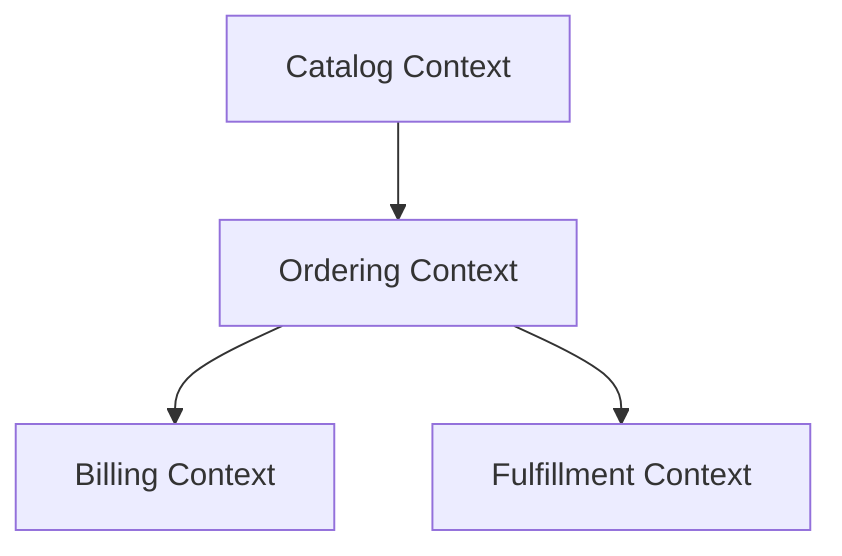
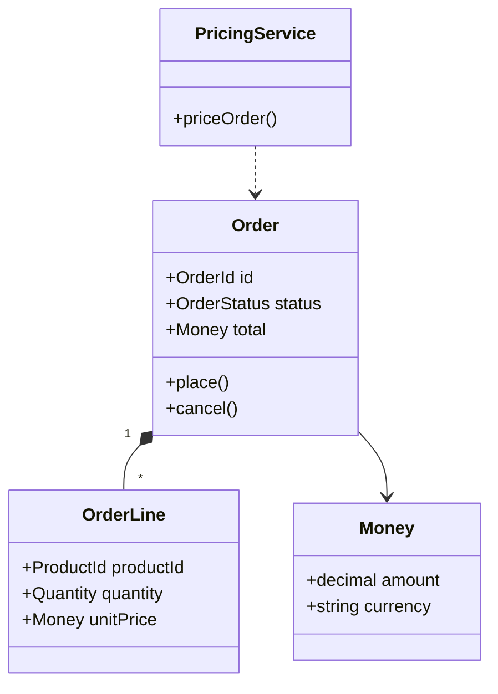

# Domain Modeling

Create the domain model that explains the business shape of the application before implementation drifts into database tables, routes, or UI components.

## Inputs

Read the strongest available sources in this order:

1. Approved FRDs and Gherkin scenarios
2. Contracts from Step 2 (`specs/contracts/` and `src/shared/types/`)
3. `specs/tech-stack.md`
4. Brownfield extraction outputs, if they exist:
   - `specs/docs/architecture/overview.md`
   - `specs/docs/architecture/components.md`
   - `specs/docs/architecture/data-models.md`
   - extracted API contracts

If code and documents disagree, use code as the tie-breaker for brownfield work.

## Output

Generate or update:

- `specs/docs/architecture/domain-model.md`

When you recommend a service split or major boundary change, also create or update an ADR in `specs/adrs/`.

## Required Sections

`specs/docs/architecture/domain-model.md` must contain:

1. **Scope**
2. **Ubiquitous Language** — key business terms with precise meanings
3. **Bounded Contexts** — named contexts and responsibilities
4. **Context Map** — Mermaid diagram showing context relationships
5. **Aggregates and Entities** — aggregate roots, entities, value objects, domain services, domain events
6. **Domain Rules / Invariants** — the rules that must always hold
7. **Implementation Mapping** — where each context/aggregate lives in the codebase or contracts
8. **Service Boundary Assessment**
   - `Keep as modular monolith` when that is the best current choice
   - `Candidate service split` only when the heuristics below support it

## Workflow

1. **Find the domain language**
   - Extract business nouns, verbs, commands, events, and policies from FRDs, Gherkin, contracts, and existing code.
   - Normalize synonyms and call out overloaded terms.

2. **Identify bounded contexts**
   - Group behavior by business capability, ownership, lifecycle, and language.
   - Prefer boundaries around business meaning, not technical layers.
   - Name each context with domain language, not infrastructure language.

3. **Model the domain**
   - Identify aggregate roots first.
   - Place entities and value objects inside their owning aggregate/context.
   - Record domain services only when behavior does not naturally belong to an entity or value object.
   - Record domain events when cross-context collaboration or workflow progression depends on them.

4. **Draw the diagrams**
   - Include a **context map** in Mermaid `graph TD` or `flowchart TD`.
   - Include an **aggregate/domain diagram** in Mermaid `classDiagram` or `erDiagram`.
   - A raw database ERD alone is not enough; show domain concepts and ownership.

5. **Assess service boundaries**
   - Default to a modular monolith unless there is clear evidence for separate services.
   - Propose a split only when a bounded context has:
     - strong business autonomy
     - clear data ownership
     - independently useful deployment/scaling/security needs
     - low need for synchronous, chatty cross-context calls
   - If those conditions are weak, explicitly recommend staying modular.

6. **Connect model to delivery**
   - Map contexts and aggregates to planned increments, contracts, and code locations.
   - If the model implies an architectural decision, raise an ADR rather than silently changing direction.

## Diagram Guidance

### Context map example

### Aggregate/domain example

## Service Split Rules

A proposal to split microservices must include:

- the bounded context name
- why the boundary is business-valid
- owned data and APIs/events
- operational driver (scale, resilience, compliance, team autonomy, release cadence)
- integration style between contexts
- key risks and why staying modular may still be preferable today

Do not propose microservices just because multiple entities exist or because the codebase is large.

## Constraints

- Do not let tables or REST endpoints define the domain by default.
- Do not invent bounded contexts that lack evidence in the specs or code.
- Do not force microservices. A well-bounded modular monolith is a valid outcome.
- Do not bury architectural proposals inside implementation text; put them in the Service Boundary Assessment and ADRs.

## References

For boundary heuristics and the theory behind these rules, read `references/boundary-heuristics.md`.
